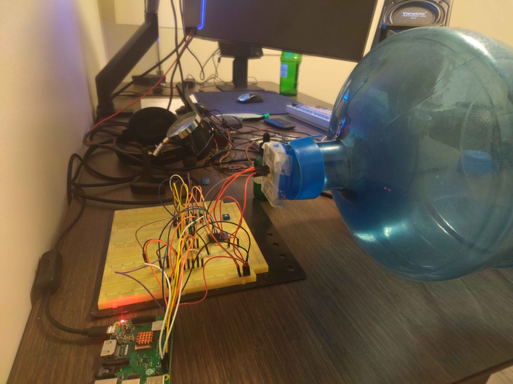
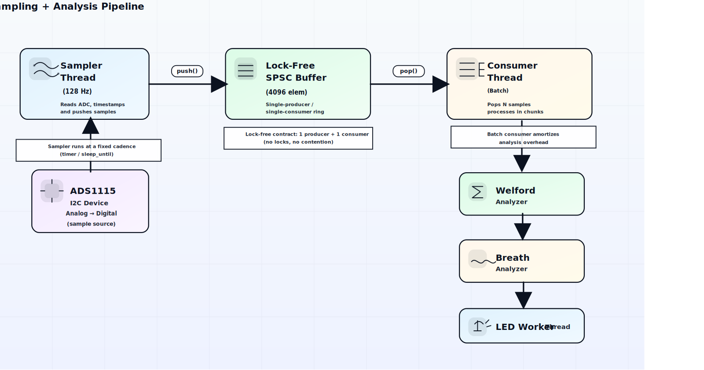
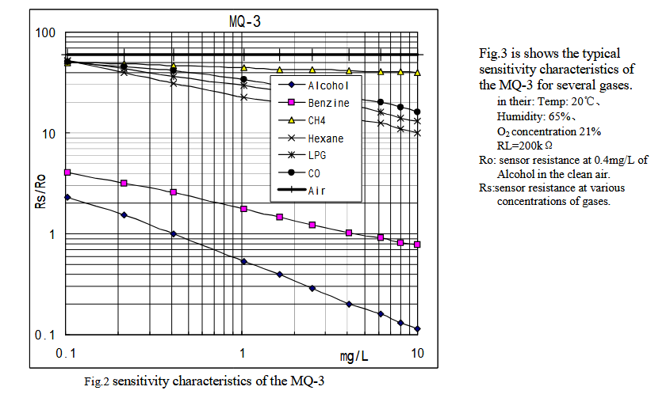

# Drunk_App - C++ Real-Time Breathalyzer System

[](https://en.cppreference.com/w/cpp/20) [](https://www.raspberrypi.org/) 

A party-grade breathalyzer application built with modern C++20. It's example embedded system with lock-free concurrent algorithms, and real-time signal processing.



## Project Overview

This project transforms a Raspberry Pi, MQ-3 alcohol sensor, and ADS1115 ADC into a functional breathalyzer with LED feedback indicators. This was built for fun to utilize familiar C++20 features, concurrent programming, and poke around with some embedded Linux development.
### What Makes this Interesting?

- **Lock-Free Concurrency**: SPSC ring buffer with proper C++20 memory ordering semantics
- **Streaming Statistics**: Welford's online algorithm for numerically stable mean/variance calculation
- **State Machine Design**: Breath detection with hysteresis and adaptive noise compensation
- **Zero-Copy Architecture**: Minimal allocations in hot paths for consistent real-time performance
- **Hardware Control**: Direct I2C and GPIO manipulation on Linux

## Hardware Components

| Component                             | Purpose           | Interface     |
| ------------------------------------- | ----------------- | ------------- |
| **Raspberry Pi** (any model)          | Main processor    | -             |
| **ADS1115** (pre soldered)            | 16-bit ADC (I2C)  | 0x48 address  |
| **MQ-3 Sensor** (non module)          | Alcohol detection | Analog output |
| **5x LEDs**                           | Status indicators | GPIO pins     |
| **Led Resistors**                     | 5x330Ω            | -             |
| **RLoad & Voltage Divider Resistors** | RL=20kΩ, VDR=10kΩ | -             |

### Circuit Diagram

I've provided a circuit diagram link below:

https://app.cirkitdesigner.com/project/94680322-f44f-4e0e-a75f-f59af580681c


Notes: I didn't use a MQ3 module as per the diagram. I cut a square piece from a prototype board and soldered the MQ3 sensor onto it. As per the image with the 5 gallon jug, I attached the sensor with the board into hole of the cap taped around it to seal it. This allowed me to jerry rig the sensor with the cap onto jug and seal it after adding alcohol inside. 
### GPIO Pin Mapping

```cpp
// From gpio_bank.h - Default LED configuration
GPIO 26 → Blue LED   (Ready state or Blinking Calibrating/Baseline)
GPIO 17 → Green LED  (Sober - BAC < 0.02%)
GPIO 27 → Yellow LED (Light - BAC 0.02-0.05%)
GPIO 22 → Orange LED (Tipsy - BAC 0.05-0.08%)
GPIO 16 → Red LED    (Drunk - BAC ≥ 0.08%)
```

## Architecture
### System Overview


### Signal Processing Pipeline

1. **Sampling** (128 Hz fixed rate using `sleep_until`)
2. **Buffering** (Lock-free ring buffer, wait-free operations)
3. **Windowing** (1-second windows with 80+ samples minimum)
4. **Analysis** (Welford's algorithm for mean/stddev/drift)
5. **State Detection** (Warmup → Ready → Processing → Analyzed → Cooldown)
6. **Display** (LED patterns via worker thread)

### Key Design Decisions

#### Why Lock-Free Ring Buffer?

```cpp
// Traditional mutex approach - introduces jitter
std::lock_guard lock(mutex);  // Variable latency
buffer.push(sample);

// Lock-free approach - guaranteed progress
head_.store(next, std::memory_order_release);  // Wait-free
```

**Reason**: The sampler must maintain precise 7.8ms timing. I did not want to introduce any additional jitter in the ADC readings. The goal is to make the sampling as real-time as possible

#### Why Welford's Algorithm?

```cpp
// Naive mean calculation - requires storing all samples
std::vector<double> samples;  // O(n) memory
double mean = std::accumulate(samples.begin(), samples.end(), 0.0) / n;

// Welford's online algorithm - constant memory
WelfordStats ws;              // O(1) memory
ws.push(value);               // Update incrementally
double mean = ws.mean;        // Available anytime
```

**Reason**: Embedded systems have limited RAM. I found that the Welford algorithm provides numerically stable sampling with zero buffering. In this case, it serves as a perfect sliding window algorithm to find a baseline voltage of the MQ3 sensor during runtime.

#### What's with the State Machine and Hysteresis?

```
Baseline (clean air) -> Start Threshold (baseline + 0.05V + 3σ)
Baseline (clean air) -> End Threshold (baseline + 0.02V + 2σ)
```

**Reason**: During testing I noticed very small noise so I added a hysteresis to my rise and falling thresholds to prevent any false triggers.
## Technical Specifications

### Default Performance Characteristics

- **Sample Rate**: 128 Hz (7812 μs period)
- **Processing Latency**: < 10ms (end-to-end)
- **Memory Footprint**: ~32 KB (ring buffer)
- **CPU Usage**: < 5% on Raspberry Pi 3B+
- **Stabilization Time**: 3-5 seconds (clean air baseline)
- **Detection Accuracy**: ±0.002V after stabilization
### Breath Detection Parameters

```cpp
// From config_settings.h - Tunable thresholds
Min Blow Time: 400ms       // Reject short bursts
Max Blow Time: 5 sec       // 5 second blowing window
Warmup Windows: 25         // Consecutive winodws to reach baseline
Cooldown Windows: 25       // Return to ready state after sampling
```

## Building & Running

### Install dependencies

```bash
# Install dependencies (Debian/Ubuntu/Raspberry Pi OS)
sudo apt-get update
sudo apt install -y build-essential cmake git pkg-config libgpiod-dev libfmt-dev i2c-tools
# Enable I2C interface
sudo raspi-config
# → Interface Options → I2C → Enable
```
### Build Instructions
#### Windows WSL Building

If you're using VSCode and have the Pi connected on the network I've added a tasks.json template you can cater to run different build types. It also run/kills the drunk process so you can test it. This was super handy when I was developing from my main windows machine.
#### 1) In VSCode, install these extensions:

- **WSL** (Microsoft)  
    Lets VSCode run “inside” your WSL distro.
    
- **Remote - SSH** (Microsoft)  
    Lets VSCode connect to the Pi and run tasks _on the Pi_.
    
- **Remote Development** (Microsoft) _(optional bundle)_  
    Installs the above + helpers.
    
- **C/C++** (Microsoft)  
    IntelliSense, basic C++ tooling.
    
- **CMake Tools** (Microsoft)  
    Configure/build targets cleanly, integrates with kits.
    
- **(Optional) CMake** (twxs)  
    Syntax highlighting for CMakeLists, etc.
#### 2) Make sure WSL is set up

1. Install WSL (Ubuntu is fine).
    
2. Open VSCode.
    
3. Click the green/blue “><” icon (bottom-left) → **“Reopen in WSL”**.
#### 3) Setup SSH keys + Agent (So you don't have to input password every time)

In WSL terminal:

```bash
ssh-keygen -t edkey -f ~/.ssh/id_edkey -N ""
ssh-copy-id -i ~/.ssh/id_edkey.pub pi@hostname
```

Verify:

```bash
ssh pi@hostname "uname -a"
```

if you have issues make sure to check permissions are set inside ~/.ssh/key (Chmod etc..)

```bash
# Clone repository
git clone https://github.com/staticJPL/Drunk_App.git
cd Drunk_App

# Build
mkdir build && cd build
cmake .. -DCMAKE_BUILD_TYPE=Debug
make -j$(nproc)

# Run (requires root for I2C/GPIO access)
sudo ./drunk_app
```
#### Check GPIOD & I2c Hardware 

```bash
# Check I2C devices
sudo i2cdetect -y 1
# Should show device at 0x48 (ADS1115)

# Check GPIO chip
ls -l /dev/gpiochip*
# Should show /dev/gpiochip0
```

## Calibration Process

The calibration process was based on fitting a custom regression line using the manufacturer’s sensitivity curve (see datasheet figure below)..



To anchor the regression, I selected an initial calibration point where the sensor ratio **Rs/Ro = 1**. According to the datasheet graph, this corresponds to approximately:

18.9×0.4 mg/l of ethanol vapor concentration.

Ideally, this would require introducing pure ethanol into the 5-gallon jug. Since laboratory-grade ethanol was not available, I instead used 40% ABV dry gin and calculated the equivalent volume of pure ethanol it contained. The liquid volume of gin was adjusted so that the total ethanol content matched the target concentration proportionally.

Using a precision scale, I measured incremental droplet additions of gin into the chamber and recorded each step as a discrete calibration point in the calibration spreadsheet. After each addition, I let the system reach equilibrium and let the calibration runtime capture the steady-state sensor value before proceeding to the next increment.
### Sensor Resistance Calculation

The MQ-3 sensor's resistance changes with alcohol concentration. We need to find **R₀** (sensor resistance in clean air).

```
// Code comments

Circuit Analysis:
-----------------
Vout = VCC × (RL / (Rs + RL))    # Voltage divider equation
Rs = RL × ((VCC / Vout) - 1)     # Solve for sensor resistance

With 3.3V protection:
---------------------
Vadc = Vout × (RL / (R1 + RL))   # R1=10kΩ, RL=20kΩ
Vout = Vadc × 1.5                # Back-calculate to 5V domain
```

### Step-by-Step Calibration

Before doing any calibration or even running alcohol test a fresh sensor needs a break in period.

- Connect the MQ3 sensor to 5v VCC and Gnd
- Feel if the sensor heats up.
- Let the sensor stay powered for 48 hours.
- Come back and being Phase 1.

 #### **Phase 1: Find Baseline (R₀)**
 
2. **Run Calibration Mode**
    
    ```cpp
    // In main.cpp - Uncomment this line:
    int status = DrunkAPI::RunSession<CalibrationProcess>(s_address);
    ```
    
3. **Build and Execute**
    
    ```bash
    make && sudo ./drunk_app
    ```
    
4. **Wait for Stable Reading**
    
    ```
    Output will show:
    Window mean=1.787594V sd=0.001234V drift=0.000123V/s stable=false
    ...
    Window mean=1.787598V sd=0.001198V drift=0.000089V/s stable=true
    Stable Value Found! mean=1.787594
    RS Stable found = ~X Ohms // Close to RLoad 
    Rs/Ro: 60.000000 // Ignore for first step when finding Ro (air)
    ```

	Note: If you're not fitting your own curve. You assume the data point on the data sheet and solve for Ro. Since Rs/Ro = 60, you'll have Ro = Rs / 60.
	
2. **Record R₀ Value**
    - Open `source/config_settings.h`
    - Update: `inline constexpr const double Ro_Air = 685.124026;`

#### **Phase 2: Verify with Known Concentration** (Optional)

For slightly better accuracy, you can perform the sealed jug method I mentioned earlier with known ethanol concentration:

```
Materials:
----------
- Sealed container (e.g., 18.9L water jug)
- Pure ethanol (e.g., 95% If you're lucky to get it)
- Or Dry Gin %40.
- Pipette/Dropper for precise measurement
- Precision scale (0.001g) precision is okay.

Procedure:
----------
1. Calculate ethanol needed for target concentration:
   Volume (mL) = (target_mg/L × container_L) / (density × purity)
   Example: For 1.0 mg/L in 18.9L jug:
   Volume = (1.0 × 18.9) / (789 × 0.95) ≈ 0.025 mL

2. Inject ethanol into sealed jug
3. Shake it with the cap on and wait 10 minutes for evaporation/mixing
4. Insert sensor, seal the jug and run calibration
5. Compare measured Rs/Ro ratio with datasheet curve
```

See `Calibration_Sheet_Example/` for spreadsheet that contains real data:

- Sample data collection table
- Rs/Ro calculation formulas
- Log-log regression analysis
- Datasheet comparison graphs
### Understanding the Output

| Target Ethanol (mg/L) | Rs (Ω) | Rs/Ro |
| --------------------- | ------ | ----- |
| 0.46                  | 685.12 | 1.14  |
| 0.77                  | 503.65 | 0.84  |
| 2.15                  | 420.81 | 0.70  |
| 3.59                  | 355.67 | 0.59  |
| 5.99                  | 307.54 | 0.51  |
| 10.0                  | 291.39 | 0.48  |

BAC = PPM × 0.000385505
PPM = (mg/L) × 530  (ethanol conversion factor)
## Usage

### Runtime Mode

After you've calibrated and set your slope equation in `source/config_settings.h`  switch to runtime mode:

```cpp
// In main.cpp - Uncomment this line:
int status = DrunkAPI::RunSession<RuntimeProcess>(s_address);
```

### LED Status Indicators

| LED Color | State | Meaning                           |
| --------- | ----- | --------------------------------- |
| 🔵 Blue   | Ready | System ready, waiting for breath  |
| 🟢 Green  | Sober | BAC < 0.02% (Safe to drive)       |
| 🟡 Yellow | Light | BAC 0.02-0.05% (Impaired)         |
| 🟠 Orange | Tipsy | BAC 0.05-0.08% (Legally impaired) |
| 🔴 Red    | Drunk | BAC ≥ 0.08% (Legally intoxicated) |
### State Transitions

```
[Warmup] → Finding baseline (25 windows ≈ 25 seconds)
    ↓
[Ready] → Blue Solid LED - Blow into sensor now
    ↓
[Processing] → All LEDs blink - Breath detected
    ↓
[Analyzed] → BAC displayed for 10 seconds
    ↓
[Cooldown] → Blue LED blinks - Waiting for sensor to reach baseline
    ↓
[Ready] → Back to ready state
```

### CSV Data Export (Optional)

The project includes a TCP-based CSV exporter so we don't need to store data persistently on the SD card. I created this data sink so I can capture row data samples. 

```cpp
// In main.cpp - Uncomment these lines:
TCP_config host_config;
DrunkAPI::CSVNet CsvSink{host_config};
CsvSink.Connect();
```

**On your host machine:**

```bash
# Listen for incoming data
nc -l 9009 > sensor_data.csv
```

**Use cases:**

- Collect training data for calibration
- Create simulated test datasets
- Debug sensor behavior
- Analyze drift over time
## Code Deep Dive

### Lock-Free Ring Buffer

```cpp
// From spsc.h - Wait-free push operation
bool push_overwrite(const T& value) {
    auto head = head_.load(std::memory_order_relaxed);
    auto next = (head + 1) & (N - 1);  // Fast modulo via bit mask
    
    // If full, advance tail (drop oldest)
    if (next == tail_.load(std::memory_order_acquire)) {
        auto tail = tail_.load(std::memory_order_relaxed);
        tail_.store((tail + 1) & (N - 1), std::memory_order_release);
    }
    
    ring_buffer_[head] = value;
    head_.store(next, std::memory_order_release);  // Publish to consumer
    return true;  // Always succeeds
}
```

**Key Points:**

- `memory_order_acquire/release`: Ensures proper visibility without full barriers
- Ring size must be power of 2 for fast `& (N-1)` instead of `% N`
- `alignas(64)`: Prevents false sharing between producer/consumer cache lines

### Welford's Algorithm

```cpp
// From analyzer.h - Numerically stable variance
void push(double value) {
    ++num_samples;
    const double delta  = value - mean;
    mean += delta / num_samples;
    const double delta2 = value - mean;  // recompute important
    m2 += delta * delta2;
}

double variance_sample() const {
    return (num_samples > 1) ? (m2 / (num_samples - 1)) : 0.0;
}
```

**Why This Works:**

- Avoids catastrophic cancellation (mean - large_value)
- Single-pass algorithm (no need to store data)
- O(1) memory regardless of sample count
- Numerically stable for large sample sets.
### Breath State Machine

```cpp
// From analyzer.cpp - Adaptive threshold calculation
const double start_threshold = 
    baseline_mean +                    // Dynamic baseline
    bcfg.start_delta_v +               // Fixed hysteresis (0.05V)
    (bcfg.start_k_sigma * baseline_std); // Noise compensation (3σ)

// Only trigger if:
// 1. Current value exceeds threshold
// 2. Sustained for minimum duration
// 3. Falls below end_threshold to finalize
```

**Benefits:**

- Adapts to temperature/humidity drift
- Rejects electrical noise spikes
- Prevents bounce between states
## Learning Gains

### C++ Expertise Gained

- **Memory Model**: Real world understanding of `std::memory_order` semantics
    - When to use `acquire/release` vs `relaxed` vs `seq_cst`
    - Cache coherence and false sharing prevention
- **RAII Patterns**: Managing C resources safely
    - Custom deleters for `gpiod_*` handles
    - File descriptor lifetime management
- **Template Metaprogramming**: Zero-cost abstractions
    - Trait-based design for compile-time polymorphism
    - `constexpr`/`consteval` for guaranteed compile-time evaluation
    - SFINAE with `requires` expressions

### Systems Programming

- **Lock-Free Algorithms**: Practical concurrent data structures
    - Producer-consumer patterns without mutexes
    - Memory ordering guarantees for visibility
- **Real-Time Concepts**: Deterministic timing on non-RTOS
    - Fixed-timestep loops with `sleep_until`
    - Jitter analysis and mitigation
- **Linux Hardware Control**: Direct kernel interface usage
    - I2C via `ioctl()` and `i2c_rdwr_ioctl_data`
    - GPIO via modern `libgpiod` (not deprecated sysfs)
### Signal Processing

- **Streaming Sample Algorithms**: Handling infinite data samples
    - Welford's algorithm for stable sampling
    - Real implemented sliding window analysis
- **Noise Filtering**: Practical sensor data cleanup
    - EWMA filtering for baseline tracking
    - Hysteresis for state transitions
    - Drift compensation
## 🔬 Future Enhancements

- Add real sample data set for simulation
- Web socket to stream to a webserver. 
## 📖 References

### Datasheets & Specifications

- [ADS1115 16-Bit ADC Datasheet](https://www.ti.com/lit/ds/symlink/ads1115.pdf)
- [MQ-3 Alcohol Sensor Datasheet](http://www.handsontec.com/dataspecs/sensor/MQ-3.pdf)
- [Linux I2C/dev Interface](https://www.kernel.org/doc/html/latest/i2c/dev-interface.html)
- [libgpiod Documentation](https://git.kernel.org/pub/scm/libs/libgpiod/libgpiod.git/about/)

### Algorithms & Theory

- [Welford's Online Algorithm](https://en.wikipedia.org/wiki/Algorithms_for_calculating_variance#Welford's_online_algorithm)
- [C++ Memory Ordering](https://en.cppreference.com/w/cpp/atomic/memory_order)
- [Lock-Free Programming](https://preshing.com/20120612/an-introduction-to-lock-free-programming/)
### Inspiration

- Built as a learning project to understand C++20 and embedded systems
- No production use intended - for educational purposes only
## ⚠️ Disclaimer

**This device is for educational purposes only and should NOT be used for:**

- Legal BAC determination
- Deciding fitness to drive
- Medical diagnosis
- Any safety-critical application

**Reasons:**

- Uncalibrated sensor (hobby-grade accuracy)
- No temperature/humidity compensation
- Simplified breath detection (not medical-grade)
- No regulatory compliance (FDA/CE/etc.)

**For accurate BAC measurement, use certified commercial breathalyzers.**

## 📝 License

MIT License - See LICENSE file for details.

## 🤝 Contributing

This is a personal learning project, but feedback is welcome! Feel free to:

- Open issues for bugs or questions
- Suggest improvements via pull requests
- Share your own calibration data
- Discuss technical decisions in discussions tab

## 📧 Contact

- **GitHub**: [@staticJPL](https://github.com/staticJPL)
- **Project Link**: [https://github.com/staticJPL/Drunk_App](https://github.com/staticJPL/Drunk_App)

---

**Built with** ❤️ **and lots of coffee (not alcohol)**

_Tech Stack: C++20 · CMake · Raspberry Pi · I2C · GPIO · Lock-Free Programming · Signal Processing_
